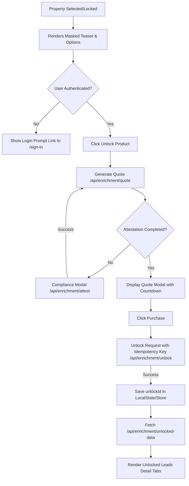

# Lead Intelligence Enrichment Frontend UI (Phase 1L)

This document describes the implementation of the buyer-facing lead enrichment UI for the StormTarget map.

## Files Changed

1. [types.ts](file:///C:/Users/jimbo/.gemini/antigravity/worktrees/storm-map/build-storm-intel-map/lib/weather/types.ts)
   - Added optional `unlockId?: string` property to the `SelectedPropertyTarget` type to track purchase state across user selections.
2. [StormSidebar.tsx](file:///C:/Users/jimbo/.gemini/antigravity/worktrees/storm-map/build-storm-intel-map/components/storm-map/StormSidebar.tsx)
   - Imported and rendered `LeadIntelligencePanel` immediately beneath the active geocoded property targeting indicator.
   - Bound callback props to pass lead state changes back up to the main controller.
3. [page.tsx](file:///C:/Users/jimbo/.gemini/antigravity/worktrees/storm-map/build-storm-intel-map/app/page.tsx)
   - Implemented `handleUpdateLead` state handler to propagate lead updates (e.g. `unlockId` assignments) back down to the sidebar and persist updates in `localStorage`.
4. [unlock/route.ts](file:///C:/Users/jimbo/.gemini/antigravity/worktrees/storm-map/build-storm-intel-map/app/api/enrichment/unlock/route.ts)
   - Modified to store both `propertyProfile` and `roofIntelligence` inside the existing JSONB `propertyProfilePayload` column upon unlock.
   - Modified the replay path to look inside `propertyProfilePayload` for nested objects to prevent breaking.
5. [unlocked-data/route.ts](file:///C:/Users/jimbo/.gemini/antigravity/worktrees/storm-map/build-storm-intel-map/app/api/enrichment/unlocked-data/route.ts)
   - Modified to unpack `propertyProfile` and `roofIntelligence` separately from the stored JSONB payload so roof intelligence is successfully retrieved on page reloads.

## Components Created

All components reside in the [components/storm-map/enrichment/](file:///C:/Users/jimbo/.gemini/antigravity/worktrees/storm-map/build-storm-intel-map/components/storm-map/enrichment/) folder:

1. **`enrichment-client.ts`**
   - Safe API client wrapper for fetches targeting `/storm-map/api/enrichment/*` endpoints. Prepends the basePath dynamically and parses errors into typed `EnrichmentApiError` instances.
2. **`LeadIntelligencePanel.tsx`**
   - The master orchestrator component.
   - Handles teaser display, auth redirection, credits display, and renders the tabs once unlocked.
3. **`EnrichmentProductCards.tsx`**
   - Renders the 4 options: Property Profile (5 credits), Owner Contact (10 credits), Roof Intelligence (10 credits), Full Storm Lead (20 credits - Recommended).
4. **`ComplianceAttestationModal.tsx`**
   - Displays TCPA/DNC legal agreements before quoting.
5. **`UnlockLeadModal.tsx`**
   - Calls the backend Quote endpoint, displays a live quote countdown timer, and lets the user purchase the lead with a client-generated UUIDv4 `Idempotency-Key` header.
6. **`UnlockedLeadDetails.tsx`**
   - Renders tabbed views (Overview, Owner Contact, Property Details, Roof Intelligence, Storm Context, Source & Compliance) displaying the returned lead data.

## Interactive Flow

## Safety Gates & Constraints

### 1. localStorage vs. Server State (Correction 1)
`localStorage` is strictly used for UI state convenience (to retain the `unlockId` mapping to a lead after a refresh). The UI does not trust the client to prove ownership. All unlocked details are fetched live from `/api/enrichment/unlocked-data`, which validates that the requesting Clerk account owns that `unlockId`. Stale or invalid `unlockId`s fail gracefully by clearing the client state, allowing users to re-purchase if needed.

### 2. Teaser vs. Real Data (Correction 2)
The masked teaser data is completely static and illustrative. It is labeled with a clear disclaimer: *"Preview is illustrative. Actual data availability varies by provider/source coverage."* Upon successful unlock, only the provider response from the database is displayed.

### 3. Feature Disabled Behavior (Correction 3)
Because `ENRICHMENT_FEATURE_ENABLED` is set to `false` in production config, the UI checks and handles `503 FEATURE_DISABLED` responses. A permanent banner is rendered in the panel header, and the product cards' buttons are disabled to prevent users from encountering broken pages.

### 4. Auth Behavior (Correction 4)
If the user is not logged in, they can still view the main map features and storm warnings. Only the lead enrichment card renders a sign-in card linking to `/storm-map/sign-in`.

### 5. Stripe & Real Providers Blocked (Correction 5)
- No Stripe dependencies or packages have been added.
- Credit balance displays a placeholder (`Credits: —`) with notice that payment is coming soon.
- Insufficient credits fail with: *"Insufficient credits. Credit purchase is coming soon. Contact us to add credits."*
- No real provider credentials or API integrations have been activated.

## Remaining Risks
- Storing `unlockId` in client storage is convenient but can be cleared if a user wipes browser data. If they clear cookies, they lose their visual unlock history (though the database ledger persists it).
- If Clerk session expires, fetching `/api/enrichment/unlocked-data` will throw an authorization error. The client handles this gracefully by resetting the active view and prompting login.
